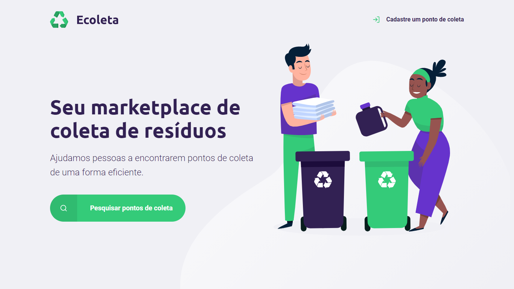

<h1 align="center">
    Next Level Week by 
    </h1>
  
  <p align="center">
  
</p>

_________

### 🤔 Mas o que é isso? 
A NLW é uma experiência online criada pela Rocketseat de uma semana com muito conteúdo prático, desafios, hacks e um projeto que nos ajudam a avançar para o próximo nível e impulsionar a nossa carreira.

_________

## 🚀 Tecnologias

Esse projeto foi desenvolvido com as seguintes tecnologias:

- [React](https://reactjs.org)
- [TypeScript](https://www.typescriptlang.org/)
- [Node.js](https://nodejs.org/en/)
- [Knex](http://knexjs.org/)
- [SQLite](https://www.sqlite.org/index.html)
- [React Native](https://facebook.github.io/react-native/)
- [Expo](https://expo.io/)

## 💻 Projeto

   ><p style="margin-left:5em">🏭  &nbsp;&nbsp;&nbsp;&nbsp;./server - API REST usando TypeScript, Express e banco de dados SQLite </p>
   ><p style="margin-left:5em">🔮  &nbsp;&nbsp;&nbsp;&nbsp;./web - Interface web em RectJS e TypeScript </p>
   ><p style="margin-left:5em">📱 &nbsp;&nbsp;&nbsp;&nbsp;./mobile - Interface mobile em ReactNative, TypeScript e Expo </p>

_________

### ✨ Sobre o projeto:


O Ecoleta é um projeto criado para gerenciar o processo de coleta de lixo nas cidades. Com ele, é possível ajudar pessoas a encontrarem pontos de coleta de uma forma mais eficiente.

<p align="center">

</p>

_________

## 🙅 Instalações e usos

Clone ou faça o downlod desse repositório:

```
# Clone o repositório
$ git clone https://github.com/rosooares/nextlevelweek
```

Acesse a pasta server e faça as instalações:

```
# Acesse a pasta do backend
$ cd server/

# Instale as dependencias
$ npm

# Execute as migrations
$ npm knex:migrate

# Execute os seeds
$ npm knex:seed

# Rode a API
$ npm dev
```
Agora importe o arquivo Insomnia-All_2020-06-03.json para o seu Insomia e faça os testes.
_________

Agradecimentos [Rocketseat](https://rocketseat.com.br/)

👤 **Roberta Soares**
* Github: [@Rosooares](https://github.com/rosooares)
* Linkedin: [@Rosooares](https://www.linkedin.com/in/robertassoares/)